# LAPORAN PRATIKUM 

## MULAI
### STEP 1 
Import modul di gunakan untuk mengimpor modul random yang menyediakan fungsi bilangan acak. 

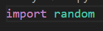

### STEP 2
Pengguna memasukkan nilai n. Integer di gunakan untuk mengkonversi teks menjadi bilangan bulat. 

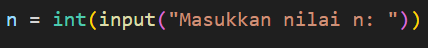

### STEP 3 
Variabel i digunakan sebagai penghitung untuk mencatat jumlah bilangan acak yang sudah dihasilkan dan ditampilkan. 

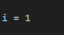

### STEP 4
while i <= n: adalah loop while yang akan berjalan selama nilai i masih lebih kecil atau sama dengan n. 

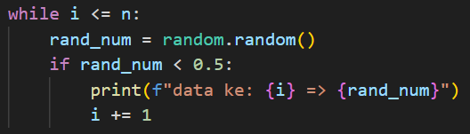

### STEP 5
rand_num = random.random() menghasilkan bilangan acak antara 0 dan 1 menggunakan fungsi random(). 

### STEP 6
Setelah loop while selesai. Maka program akan mencetak selesai. 

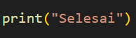

### KODE PROGRAM 
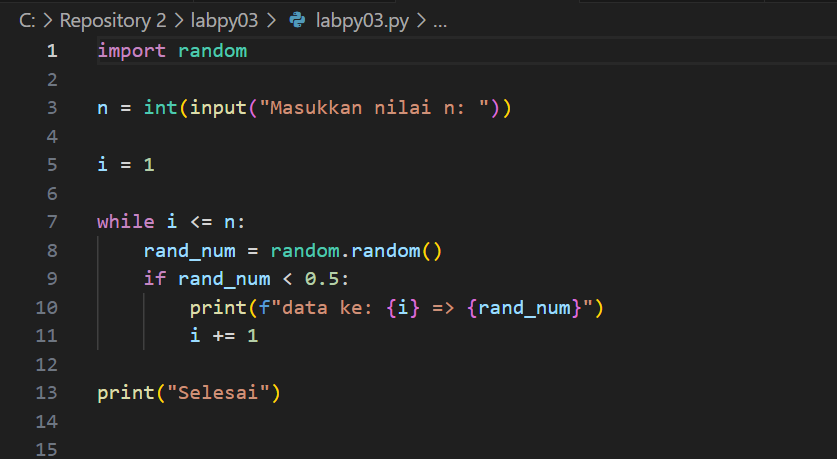

### HASIL KODE PROGRAM 
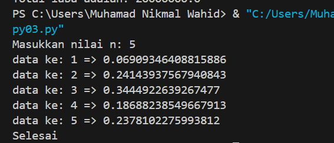

## Latihan 2 
### STEP 1
Pada bagian modal_awal d9 isi 100 juta sebagai modal yang di investasikan. Total_laba diinisialisasi dengan nilai 0. 

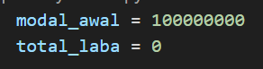

###  STEP 2 (LOOPING)
for bulan in range(1, 9) menjalankan loop for yang akan berjalan dari bulan 1 hingga bulan 8. bulan berfungsi sebagai variabel. 

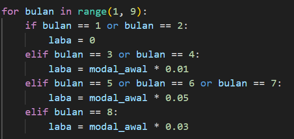

### STEP 3  
if-elif digunakan untuk menentukan laba dari bulan 1-8. 

### STEP 4
Program akan menampilkan laba yang diperoleh pada setiap bulan. 

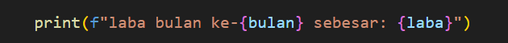

### STEP 5
total_laba += laba menambahkan laba bulanan yang telah dihitung ke dalam total_laba 

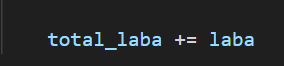

### STEP 6
Menampilkan laba. 

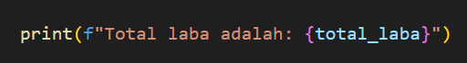

### KODE PEMROGRAMAN 
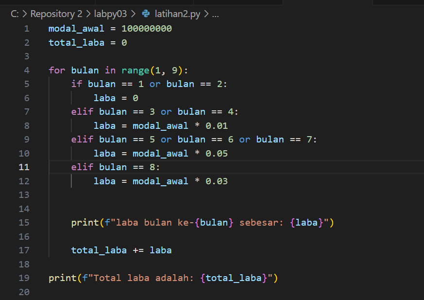

### HASIL 
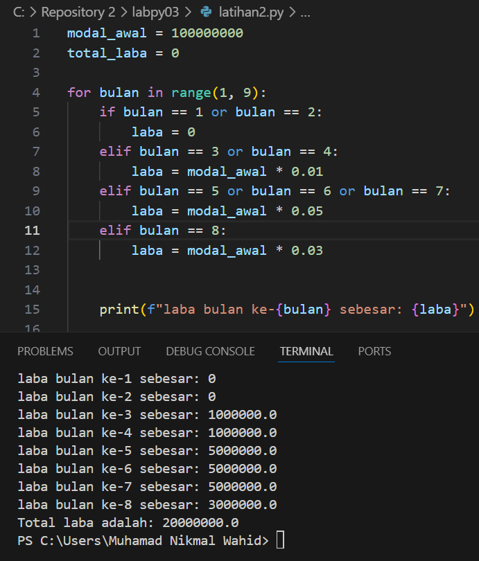

## LATIHAN 3
### STEP 1
Program di mulai dengan variabel saldo sebesar 1000000 sebagai saldo awal pengguna ATM. 

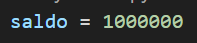

## STEP 2
Fungsi tampilkan_menu dibuat untuk menampilkan saldo saat ini dan terdapat dua pilihan menu. Fungsi ini akan di panggil dalam loop utama untuk memperbarui tampilan dan menu saldo setiap kali diperlukan. 

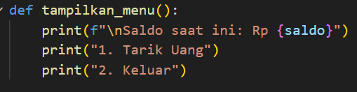

### STEP 3
Program akan memasuki loop utama . Di awal setiap iterasi, fungsi tampilkan menu akan muncul untuk menampilkan saldo dan beberapa opsi. 

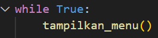

### STEP 4
Pengguna diminta memasukkan pilihan menu. 

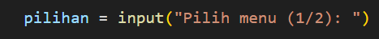

### STEP 5.1
Pilihan 1 = Apabila pengguna memilih '1', program akan meminta pengguna untuk memasukkan jumlah uang yang ingin ditarik, lalu mengonversi input ke dalam tipe integer. 

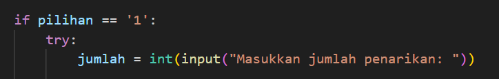

### STEP 5.2
Jika Jumlah > saldo : Program akan menampilan pesan SALDO TIDAK CUKUP. Jika Jumlah <= 0 maka jumlah penarikan tidak valid. Jika saldo cukup penarikan berhasil. 

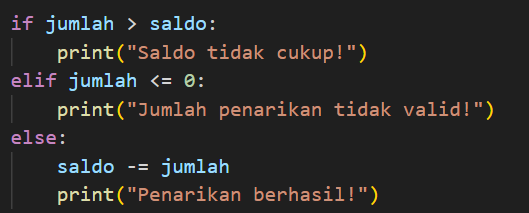

### STEP 5.3 
Apabila pengguna memilih angka 2 maka program akan menampilkan pesan. 

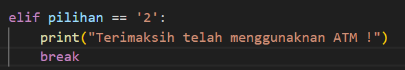

### STEP 6
Program akan terus berjalan dan menampilkan saldo serta pilihan menu hingga pengguna memilih opsi "Keluar" (pilihan '2'), yang mengakhiri loop dan program.

### KODE PEMROGRAMAN
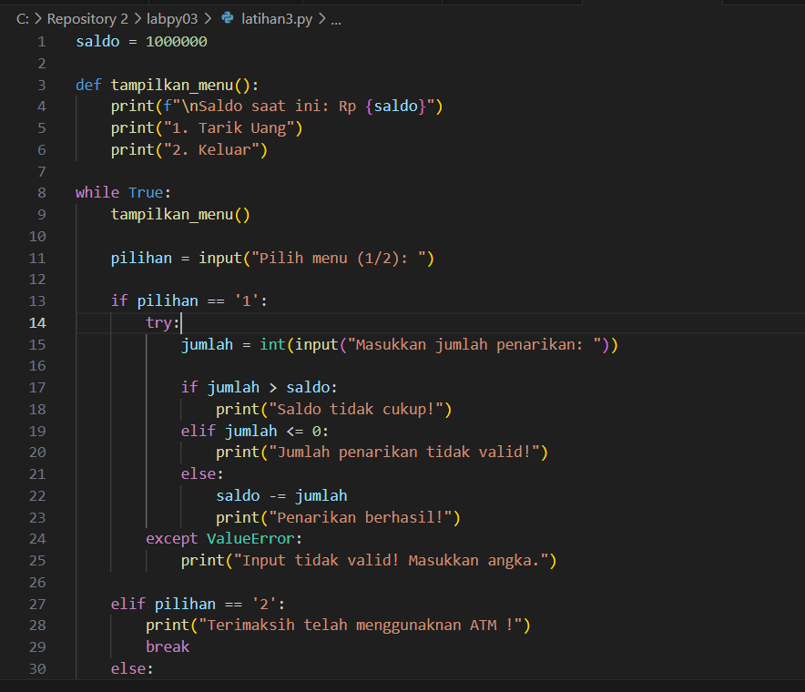

### HASIL 
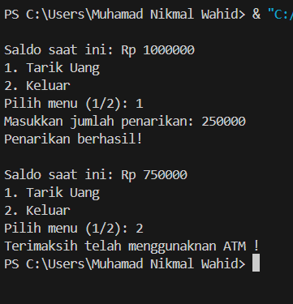